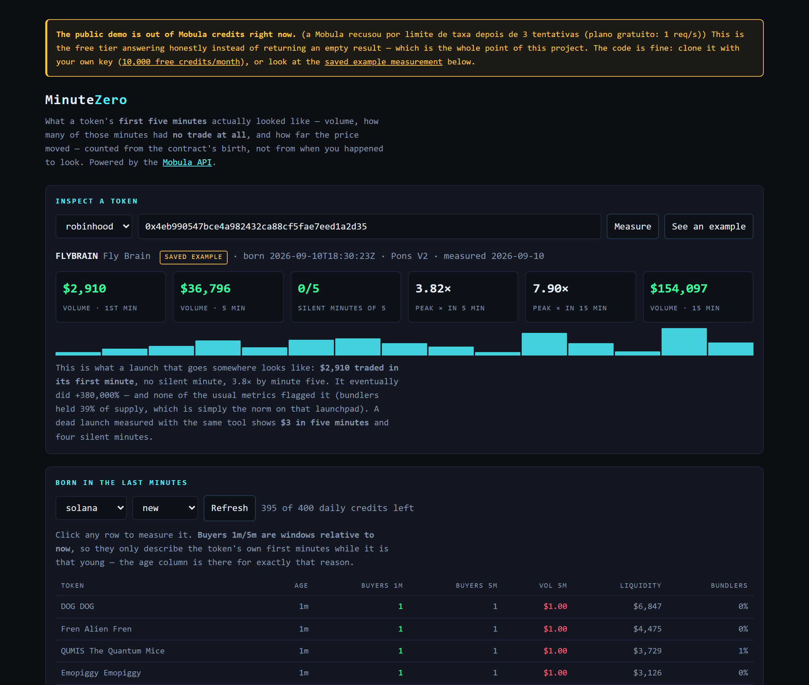

# MinuteZero — See a token's first five minutes, measured from block zero | Built with Mobula API

> MinuteZero is an open-source token-launch inspector that measures what happened in a token's **first minutes of life** — volume, silent minutes and price move — counted from the contract's birth, using the [Mobula API](https://mobula.io).

Roughly **1,400 tokens are deployed every day** on a single launchpad family, and in a sample of **1,396 launches measured by candles, the median peak was 1.00×** — most of them never trade at all. MinuteZero exists to tell those two populations apart in the only window where it still matters: **the pick that separates them happens at a median of 20 minutes**, so a portrait taken at 30 minutes arrives after the move is over.

[](https://mobula.io)
[](https://docs.mobula.io)
[](https://mobula.io)
[](./LICENSE)

## TL;DR

- **What it does:** shows the first 1/3/5/15 minutes of any token — USD volume, how many of those minutes had **no trade at all**, and the peak multiple — plus a live feed of tokens born minutes ago.
- **What it uses:** [Mobula](https://mobula.io) Pulse (`/api/2/pulse`), Token Details (`/api/2/token/details`) and OHLCV history (`/api/2/token/ohlcv-history`).
- **Who it's for:** anyone studying launch dynamics — researchers, launchpad builders, traders who want evidence instead of vibes.

## Demo

[](https://minute-zero-indol.vercel.app)

*Live at [minute-zero-indol.vercel.app](https://minute-zero-indol.vercel.app). Every row is a token born
minutes ago; the columns are its own first minutes. Click one to get the full portrait.*

## About

Every launch analytics tool shows you holders, bundlers and liquidity. Those are the numbers that were **already there** when the token was deployed, and they turn out to be nearly identical between the launches that go somewhere and the ones that die: in a 1,396-launch sample, liquidity was $4,298 for the winners and $4,256 for the rest, and bundler concentration was the norm on both sides, not the exception.

The variable that actually separates them is cruder: **somebody traded it, or nobody did.** MinuteZero measures exactly that, in the token's own first minutes, and refuses to blur the line between "no trades" and "no data".

## Why Mobula API?

- **One call gives the whole birth of a token.** `createdAt` (the real on-chain contract birth), holders, liquidity, bundler and dev concentration, launchpad name — no block explorer scraping.
- **Pulse returns 50 freshly-born tokens per request**, across chains, already carrying per-window trading counters — discovery without running an indexer.
- **1-minute OHLCV with an explicit time range**, which is what makes "since birth" measurable at all.
- **Multi-chain with one interface:** Solana, Ethereum, BNB, Base, Polygon, Arbitrum and Robinhood Chain in this project alone — same request shape, only `chainId` changes.
- **A free tier you can actually build on:** 10,000 credits/month, no card required ([pricing](https://docs.mobula.io/pricing)).
- **Official SDK** ([npm](https://www.npmjs.com/package/@mobula_labs/sdk), [GitHub](https://github.com/MobulaFi/mobula-api-sdk)) when you'd rather not hand-roll fetches.

## Mobula vs alternatives, for this specific job

| Need | Mobula | CoinGecko | Moralis | Alchemy |
|---|---|---|---|---|
| Minutes-old token, already indexed | Yes, via Pulse | No — listing takes days | Partial | Partial |
| Contract birth timestamp (`createdAt`) | One field | Not exposed | Indirect | Derive from logs |
| 1-minute OHLCV with `from`/`to` | Yes | Hourly at best on free tier | Limited | Not a price API |
| Bundler / dev concentration | Included in token details | No | No | No |
| New-launch discovery feed | `/api/2/pulse` | No | No | No |
| Free tier | 10,000 credits/month | Rate-limited demo | 40k CU/day | 300M CU/month, no launch data |

## Features

- **First-minutes portrait** — volume, minutes traded, silent minutes and peak multiple for the 1/3/5/15-minute windows, all anchored to the contract's birth.
- **Per-minute volume bars** — gaps are drawn as gaps, because a missing minute is the signal.
- **Live launch feed** — newest tokens per chain with buyers in the last 1/5 minutes, liquidity and bundler share; click a row to measure it.
- **Honest failure modes** — `sem_nascimento` (no birth date), `semCandle` (no bar at all) and `limite_de_taxa` (quota refused) are three different answers, never silently folded into "zero".
- **Credit budget** — a hard daily cap per instance, so a public demo can't burn a month of quota in an afternoon.

## Tech Stack

| Layer | Choice |
|---|---|
| Runtime | Vercel Serverless Functions (Node 20+, native `fetch`) |
| Frontend | One static HTML file, zero build, zero dependencies |
| Data | [Mobula API](https://docs.mobula.io) |
| License | MIT |

## Quick Start

```bash
git clone https://github.com/joedsonalves/minute-zero
cd minute-zero
cp .env.example .env          # put your key in MOBULA_API_KEY
npx vercel dev                # http://localhost:3000
```

Get a free key at [admin.mobula.io](https://admin.mobula.io) — 10,000 credits/month.

## Mobula API integration

The whole measurement is three calls. This is the one that matters, and the comment on it is the single most expensive thing this project learned:

```js
// `from` is IGNORED unless you send `to` as well — the API happily returns the
// most recent candles instead, so a "since launch" study silently measures the
// wrong window and never raises an error.
const desdeMs = Date.parse(token.createdAt);
const url = new URL("https://api.mobula.io/api/2/token/ohlcv-history");
url.search = new URLSearchParams({
  address, chainId: "solana:solana", period: "1m", usd: "true",
  amount: 25, from: desdeMs, to: desdeMs + 20 * 60_000,
});

const { data } = await (await fetch(url, {
  headers: { Authorization: process.env.MOBULA_API_KEY },
})).json();

// Bars are SPARSE: only minutes that had trades exist. Slice by timestamp,
// never by array position, or "silent minutes" is always zero.
const janela = data.filter((c) => c.t < desdeMs + 5 * 60_000);
const negociados = new Set(
  janela.filter((c) => c.v > 0).map((c) => Math.floor((c.t - desdeMs) / 60_000))
);
console.log({ volume: janela.reduce((s, c) => s + c.v, 0), mudos: 5 - negociados.size });
```

## Mobula endpoints used

| Endpoint | Used for | Credits |
|---|---|---|
| [`/api/2/pulse`](https://docs.mobula.io/indexing-stream/stream/websocket/pulse-stream-v2) | 50 newly listed / bonding / bonded tokens per call | 5 |
| [`/api/2/token/details`](https://docs.mobula.io/rest-api-reference/endpoint/market-multi-data) | birth timestamp, holders, liquidity, bundler & dev share, launchpad | 1 per token |
| [`/api/2/token/ohlcv-history`](https://docs.mobula.io/guides/query-any-crypto-price) | 1-minute candles from birth | 5 |

A full page load costs 5 credits; measuring one token costs 6.

## Environment variables

| Variable | Required | Default | What it does |
|---|---|---|---|
| `MOBULA_API_KEY` | Recommended | — | Your Mobula key. Without it the public endpoints still answer, but you share an anonymous rate limit. |
| `MOBULA_DAILY_BUDGET` | No | `400` | Hard ceiling of credits this instance may spend per UTC day. When it's hit, the API answers `sem_cota` instead of failing quietly. |

## FAQ

### Why measure the first five minutes instead of the first hour?
Because the decision window closes early. In a sample of launches that eventually gained 50% or more, the **median peak happened at 20 minutes**, and 57% had already topped before minute 30. A criterion evaluated at 30 minutes is a criterion that buys the end of the move.

### Why not just use `buyers15min` or `volume1h` from the API?
Those are windows relative to **the moment you ask**. Query them on a 30-minute-old token and they describe minutes 15–30, not the first 15. Measured across 712 launches, the median of `buyers15min` was **0 for both the winners and the dead** — the field was answering a different question. MinuteZero anchors every window to `createdAt` instead.

### Why do "silent minutes" matter more than bundlers or holders?
Because bundler concentration doesn't separate the groups — it's the norm on that launchpad, with a median of 39% of supply, present in winners and corpses alike. Silence does: a launch that nobody trades produces no candle at all, and that is visible in minute one.

### What's the difference between "no candle" and "zero volume"?
Everything. Zero volume means the API looked and nobody traded. No candle means there's no bar to look at — which can also mean the data isn't there. This tool reports them as different answers, on purpose, because collapsing them is how a study ends up confidently wrong.

### The demo says "out of Mobula credits" — is it broken?
No. The hosted demo runs on a free-tier key with a hard daily cap, and when the quota is gone it
*says so* instead of returning an empty result — which is the behaviour this whole project argues
for. The live feed still loads; the per-token measurement falls back to a **saved example**
(FLYBRAIN, measured 2026-09-10) so you can see exactly what the output looks like. Clone it with
your own key for live measurements.

### Does the public demo use my credits?
No — the hosted demo runs on its own key with a daily cap, and will answer `sem_cota` when it's reached. For real work, clone it and set your own `MOBULA_API_KEY`.

### Which chains does it support?
Solana, Ethereum, BNB Chain, Base, Polygon, Arbitrum and Robinhood Chain. Adding one is a single line in `api/_mobula.js` — Mobula's `chainId` is the only thing that changes.

### Can I use it as an API?
Yes. `GET /api/pulse?chain=solana&secao=new` and `GET /api/first-minutes?chain=solana&address=…` return JSON, including the raw candles so you can recompute anything without spending credits again.

## Roadmap

- [ ] Side-by-side comparison of several tokens' first minutes
- [ ] CSV export of a measured cohort
- [ ] Pulse WebSocket stream instead of polling
- [ ] A public dataset of measured launches, so thresholds can be argued with numbers

## Contributing

Issues and pull requests are welcome. If you change how a window is computed, please include the reasoning in the code comment — this project's entire value is that the numbers mean what their names say.

## Mobula Bounty Program

This project was built for the [Mobula](https://mobula.io) bounty program, which rewards open-source projects powered by real on-chain data. If you're building with Mobula, the bounty board is in your [API dashboard](https://admin.mobula.io).

## Resources

- [Mobula — data and execution for onchain apps](https://mobula.io)
- [API documentation](https://docs.mobula.io)
- [Pricing and credit costs per endpoint](https://docs.mobula.io/pricing)
- [Guide: query newly listed tokens onchain](https://docs.mobula.io/guides/query-newly-listed-tokens-onchain)
- [Pulse Stream V2 reference](https://docs.mobula.io/indexing-stream/stream/websocket/pulse-stream-v2)
- [Official SDK on npm](https://www.npmjs.com/package/@mobula_labs/sdk)
- [MobulaFi on GitHub](https://github.com/MobulaFi)
- [awesome-mobula — projects built on the API](https://github.com/MobulaFi/awesome-mobula)

---

**Keywords:** token launch analytics · memecoin research · first minutes of a token · Mobula API · onchain data API · 1-minute OHLCV · newly listed tokens · launch survival rate · bundler detection · Solana launchpad · pump.fun alternative data · crypto market data API · serverless analytics · Vercel · open source crypto tools · launch discovery feed

## License

MIT — see [LICENSE](./LICENSE).

<script type="application/ld+json">
{
  "@context": "https://schema.org",
  "@type": "SoftwareApplication",
  "name": "MinuteZero",
  "applicationCategory": "DeveloperApplication",
  "operatingSystem": "Any",
  "description": "Open-source token-launch inspector that measures a token's first minutes of trading — volume, silent minutes and price move — from the contract's birth, using the Mobula API.",
  "url": "https://github.com/joedsonalves/minute-zero",
  "license": "https://opensource.org/licenses/MIT",
  "offers": { "@type": "Offer", "price": "0", "priceCurrency": "USD" },
  "isBasedOn": "https://mobula.io"
}
</script>

<!-- GitHub Topics: mobula, mobula-api, onchain-data, token-launch, memecoin, solana, ohlcv, crypto-api, market-data, vercel, serverless, open-source -->
